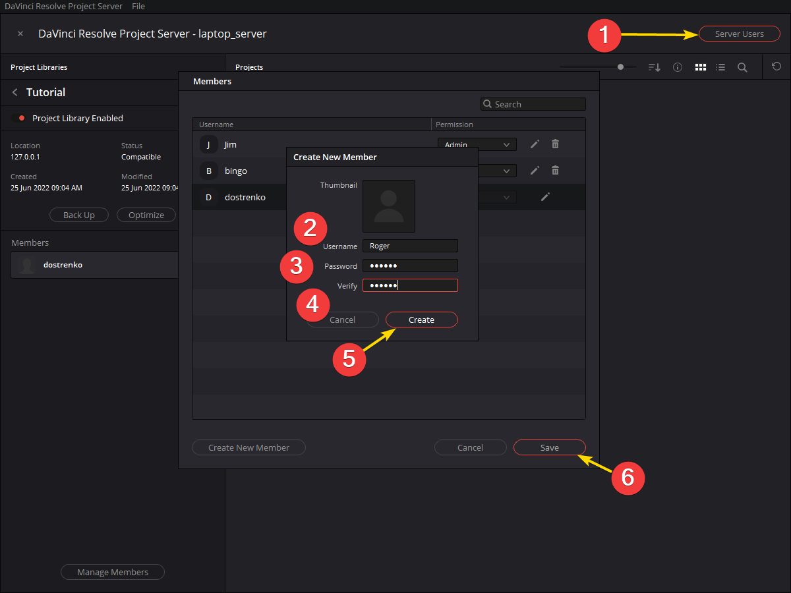
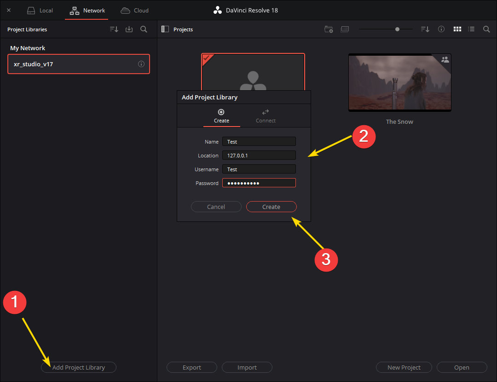

### DaVinci Project Server Setup

<sub>[previous](../) • [home](../README.md) • [next](../)</sub>


The following goes over configuring DaVinci Project Server.

<br id="chbreak">

---

##### `Step 1.`\|`BTS`|:small_blue_diamond:

Download and install DaVinci Project Server from Blackmagic Design website: https://www.blackmagicdesign.com/support/family/davinci-resolve-and-fusion. 


##### `Step 2.`\|`BTS`|:small_blue_diamond: :small_blue_diamond: 

Open the Davinci Project Server application.

Choose proper interface and enable connections


Add Project Library.


Enable Project Library by sliding the little toggle to RED.


Add Server Users.



When inside one of the project libraries (click the little "i") you can "Manage Members". Go ahead and add users to the project library here.


##### `Step 3.`\|`BTS`|:small_blue_diamond: :small_blue_diamond: :small_blue_diamond:

Run the following command in PowerShell to open port 5432 so computers can connect.

`New-NetFirewallRule -DisplayName "AllowPostreSQL" -Direction Inbound -Protocol TCP –LocalPort 5432 -Action Allow`


##### `Step 4.`\|`BTS`|:small_blue_diamond: :small_blue_diamond: :small_blue_diamond: :small_blue_diamond:

Add the following lines to your pb_hba.conf file under C:\Program Files\PostreSQL\[version]\data. This will allow machines in LSU's various subnets (inluding VPN) to connect.

```
host	all	all	130.39.0.0/16	md5
host	all	all	76.165.224.0/19	md5
host	all	all	10.0.28.0/24	md5
host	all	all	10.0.128.0/18	md5
host	all	all	10.0.192.0/19	md5
host	all	all	10.0.193.0/24	md5
host	all	all	167.96.0.0/16	md5
host	all	all	10.20.0.0/15	md5
host	all	all	10.14.0.0/16	md5
```

Restart the PostgreSQL service by going to Run > services.msc. Then right clicking on PostgreSQL > restart.


##### `Step 5.`\|`BTS`| :small_orange_diamond:

Now, users can connect to you server by using the user name and password you made earlier. Make sure yo use the same project name and IP address that the server is using.




| [previous](../)| [home](../README.md) | [next](../)|
|---|---|---|

