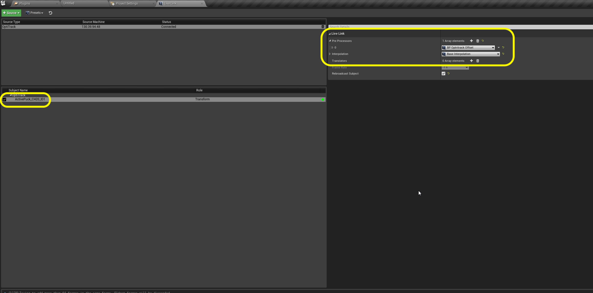
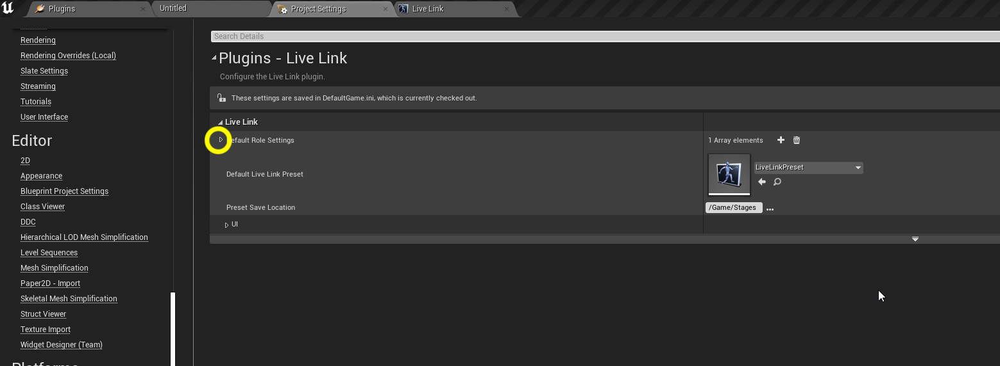
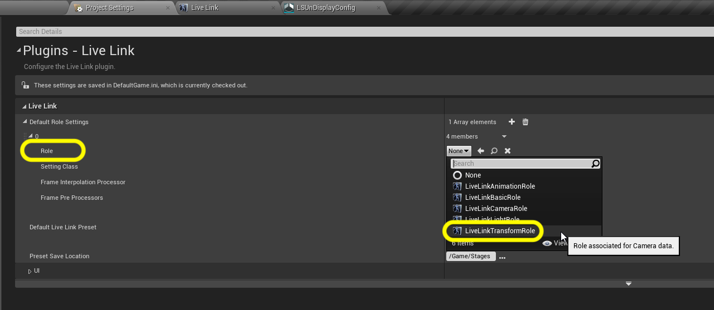
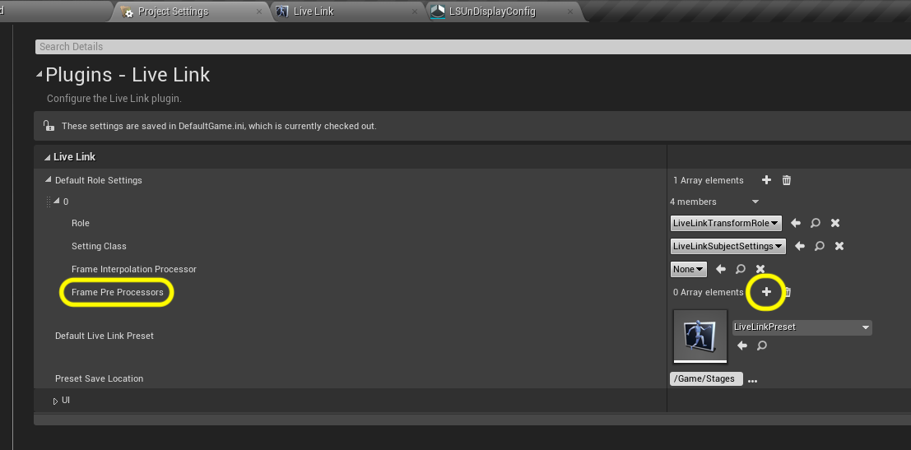

### Live Link

[previous](../) • [home](../README.md#user-content-gms2-background-tiles--sprites---table-of-contents) • [next](../hdr-output/README.md)

Now we have the base nDisplay config set up.  We need to add camera tracking into our **Template**.  We have an **OptiTrack** motion capture system that will track the cameras. We also are using a **Lonet Server** for focus tracking. We do this in **Unreal** using the **Live Link** plugin.  Lets get started.

 

---

##### `Step 1.`\|`BTS`|:small_blue_diamond:

Lets get livelink setup to bring in Mocap data from the **OptiTrack**.  Make sure the motion capture system is turned on, has streaming enabled and has a static mesh tracking the camera on set.  Go to **Window | Live Link** and add a **OptiTrack Soucce** with default settings.
 Press the <kbd>Create</kbd> button.
 

##### `Step 2.`\|`BTS`|:small_blue_diamond: :small_blue_diamond: 

Make sure your tracker has a green (not yellow or red) light and the name of the static mesh is the same as the one on the tracker. In our case it is called **ActivePuck_CH20_ID1**. Make sure that **Rebroadcast Subject** is set to `true`.

##### `Step 3.`\|`BTS`|:small_blue_diamond: :small_blue_diamond: :small_blue_diamond:

Now the orientation of the axis in OptiTrack is not the same as what **Unreal** expects.  The camera would not mimic the movement on set correctly.  We need to select the **Stage** folder and press the <kbd>Add/Import</kbd> button and select **Blueprint**.  Open up **All Classes** and this time we will search for the `LiveLinkTransformAxisSwitchPreProcessor(TransformAxisSwitch)`.

##### `Step 4.`\|`BTS`|:small_blue_diamond: :small_blue_diamond: :small_blue_diamond: :small_blue_diamond:

Call this new blueprint `BP_OptiTrack_Offset`.  Double click it.  It will either look like a normal blueprint or come in a reduced form.  In either case you want to set the **Front Axis** (what Unreal thinks of facing forward or **X**) as `-Y-axis` coming from **OptiTrack** (inverting the Y axis as the positive direction is wrong).  Set the **Right Axis** to the `X-Axis`.

##### `Step 5.`\|`BTS`| :small_orange_diamond:

Sometimes the blueprint will open up in the full editor and you can make the same adjustments in the **Details** panel.

##### `Step 6.`\|`BTS`| :small_orange_diamond: :small_blue_diamond:

Now we can open up the **LiveLink** window again and select the **ActivePuck_CH20_ID1** camera tracker in the **Subject Name** window.  Now in the **Pre Processor** press the **+** key and assign the **BP_Optitrack_Offset** blueprint in preprocessor slot `0`.

##### `Step 7.`\|`BTS`| :small_orange_diamond: :small_blue_diamond: :small_blue_diamond:

Now select **Presets** and choose `Save Preset`.  Save it to the **Stage** folder and call it `LiveLinkPreset`.

##### `Step 8.`\|`BTS`| :small_orange_diamond: :small_blue_diamond: :small_blue_diamond: :small_blue_diamond:

Now this just adds it to this tracking machine.  We also need to add it to the project configuraiton so that all the other machines can get this offset as well.  Open up the **Edit | Project Settings** folder and select **Live Link** plugin settings.  Assign `LiveLinkPreset` to **Default Live Link Preset**.  Open up the little **triangle** next to **Default Role Settings**.

##### `Step 9.`\|`BTS`| :small_orange_diamond: :small_blue_diamond: :small_blue_diamond: :small_blue_diamond: :small_blue_diamond:

Now you can set the **Role** to a `LiveLinkTransformRole`. 

##### `Step 10.`\|`BTS`| :large_blue_diamond:

Now we also need to alter the orientation and add the pre processor. Press the **+** button next to the **Frame Pre Processors**.

##### `Step 11.`\|`BTS`| :large_blue_diamond: :small_blue_diamond: 

Assign **BP_OptiTrack_Offset** to this pre processor.

##### `Step 12.`\|`BTS`| :large_blue_diamond: :small_blue_diamond: :small_blue_diamond: 

Now that we have the **LiveLink** setup we just need to have it communicate to our in game camera.  Go back  to the **Main** level and select the **RedKomodo** cinecamera.  Press the green <kbd>+ Add Component</kbd> button and select a **Live Link Controller** component. Call this component `Live Link OptiTrack`.

##### `Step 13.`\|`BTS`| :large_blue_diamond: :small_blue_diamond: :small_blue_diamond:  :small_blue_diamond: 

Now select the **Subject Representatino** in the **Live Link Controller** and pick `ActivePuck_CH20_ID1`.

##### `Step 14.`\|`BTS`| :large_blue_diamond: :small_blue_diamond: :small_blue_diamond: :small_blue_diamond:  :small_blue_diamond: 

Now you should see in game that the camera pops up to the position of where it is tracking in **OptiTrack Motive**.

https://user-images.githubusercontent.com/5504953/157681712-fd89c85f-0311-4e03-b9b3-d808dc9325ef.mp4

##### `Step 15.`\|`BTS`| :large_blue_diamond: :small_orange_diamond: 

Now we need to add focus tracking.  Go back to the **Live Link** tab and seelct **Source** and select the **LONET 2 LiveLink** plugin and press the <kbd>OK</kbd> key.

##### `Step 16.`\|`BTS`| :large_blue_diamond: :small_orange_diamond:   :small_blue_diamond: 

Make sure the camera name you have in **LoNet** shows up under **Subject Name**.  Make sure the light is green.  Keep all the default settings.

##### `Step 17.`\|`BTS`| :large_blue_diamond: :small_orange_diamond: :small_blue_diamond: :small_blue_diamond:

Now that we have the **LiveLink** setup we just need to have it communicate to our in game camera.  Go back  to the **Main** level and select the **RedKomodo** cinecamera.  Press the green <kbd>+ Add Component</kbd> button and select a **Live Link Controller** component. Call this component `Live Link Lonet`.

##### `Step 18.`\|`BTS`| :large_blue_diamond: :small_orange_diamond: :small_blue_diamond: :small_blue_diamond: :small_blue_diamond:

##### `Step 19.`\|`BTS`| :large_blue_diamond: :small_orange_diamond: :small_blue_diamond: :small_blue_diamond: :small_blue_diamond: :small_blue_diamond:

##### `Step 20.`\|`BTS`| :large_blue_diamond: :large_blue_diamond:

##### `Step 21.`\|`BTS`| :large_blue_diamond: :large_blue_diamond: :small_blue_diamond:

___

| [previous](../)| [home](../README.md#user-content-gms2-background-tiles--sprites---table-of-contents) | [next](../hdr-output/README.md)|
|---|---|---|
