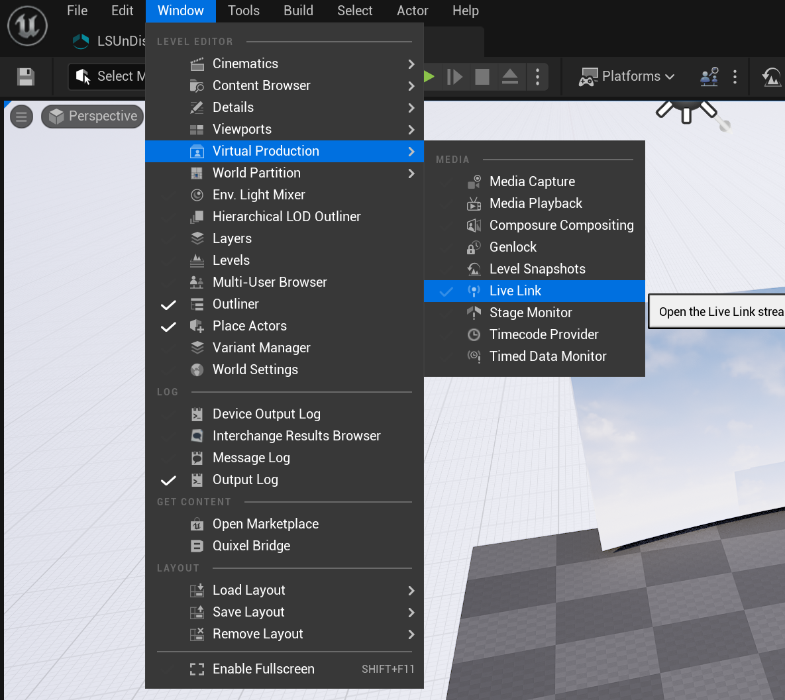
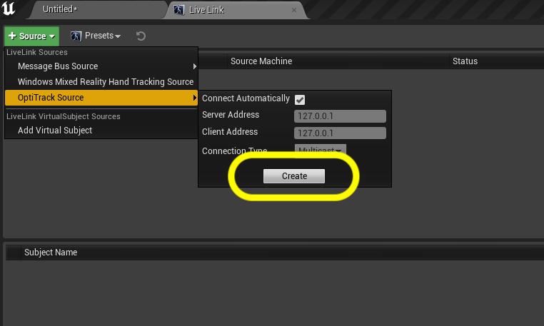
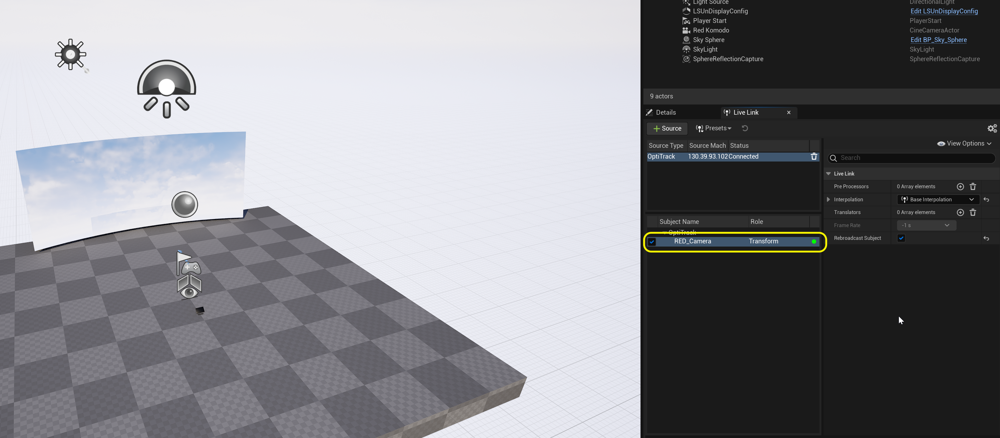
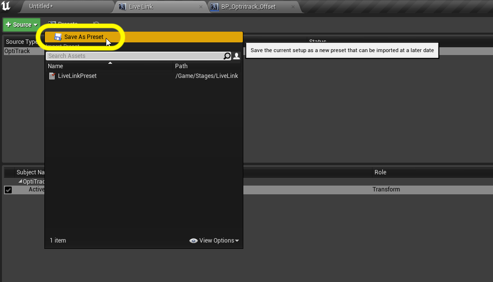
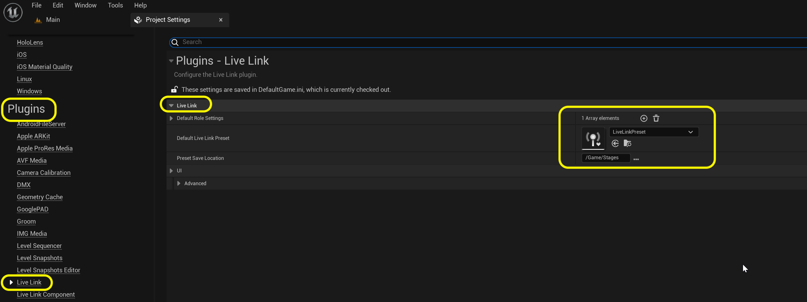
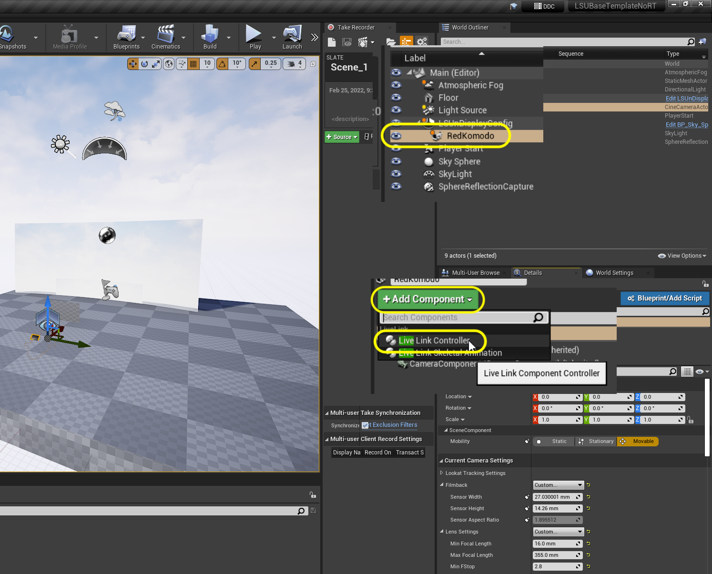
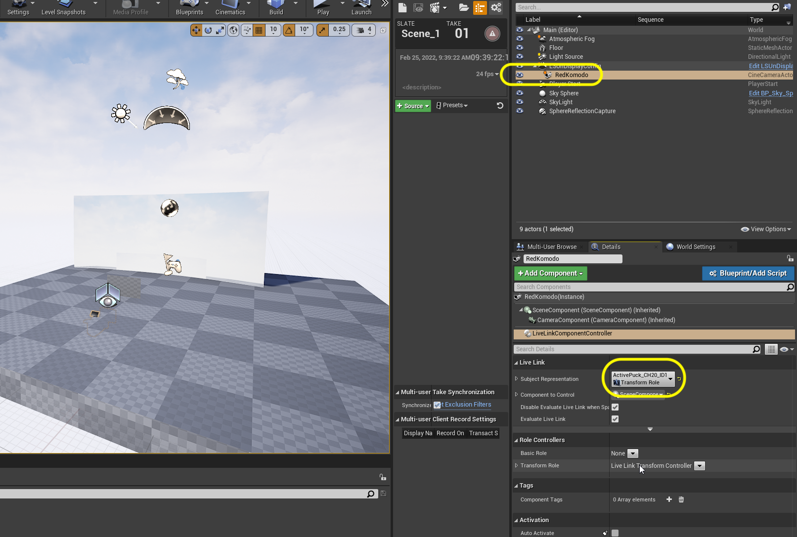
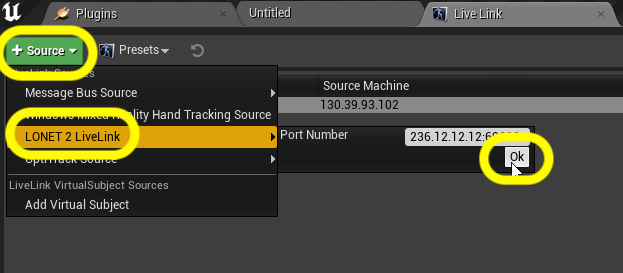
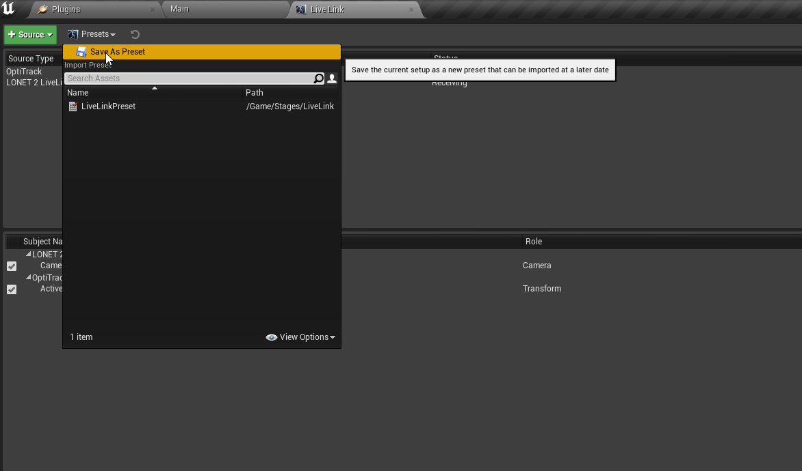

### Live Link

[previous](../ndisplay5-config/README.md#user-content-ndisplay-config) • [home](../README.md#user-content-gms2-background-tiles--sprites---table-of-contents) • [next](../hdr5-output/README.md#user-content-hdr-output)

Now we have the base nDisplay config set up.  We need to add camera tracking into our **Template**.  We have an **OptiTrack** motion capture system that will track the cameras. We also are using a **Lonet Server** for focus tracking. We do this in **Unreal** using the **Live Link** plugin.  Lets get started.

 

---

##### `Step 1.`\|`BTS`|:small_blue_diamond:

Lets get livelink setup to bring in Mocap data from the **OptiTrack**.  Make sure the motion capture system is turned on, has streaming enabled and has a static mesh tracking the camera on set.  Go to **Window | Virtual Production | Live Link**.

Press **+ Add** and select **OptiTrack Soucce** with default settings. Press the <kbd>Create</kbd> button.

 

##### `Step 2.`\|`BTS`|:small_blue_diamond: :small_blue_diamond: 

Make sure your tracker has a green (not yellow or red) light and the name of the static mesh is the same as the one on the tracker. In our case it is called **RED_Camera**. This is the rigid body that is set up in **Motive**. Make sure that **Rebroadcast Subject** is set to `true`.

##### `Step 3.`\|`BTS`|:small_blue_diamond: :small_blue_diamond: :small_blue_diamond:

Now select **Presets** and choose `Save Preset`.  Save it to the **Stage** folder and call it `LiveLinkPreset`. Press the <kbd>Save</kbd> button.

##### `Step 4.`\|`BTS`|:small_blue_diamond: :small_blue_diamond: :small_blue_diamond: :small_blue_diamond:

Now this just adds it to this tracking machine.  We also need to add it to the project configuraiton so that all the other machines can get this offset as well.  Open up the **Edit | Project Settings** folder and select **Live Link** plugin settings.  Assign `LiveLinkPreset` to **Default Live Link Preset**. 

##### `Step 5.`\|`BTS`| :small_orange_diamond:

Now that we have the **LiveLink** setup we just need to have it communicate to our in game camera.  Go back  to the **Main** level and select the **RedKomodo** cinecamera.  Press the green <kbd>+</kbd> button and select a **Live Link Controller** component. Call this component `CameraLocationLiveLink`.

##### `Step 6.`\|`BTS`| :small_orange_diamond: :small_blue_diamond:

Now select the **Subject Representation** in the **Live Link Controller** and pick `RED_Camera`.

##### `Step 7.`\|`BTS`| :small_orange_diamond: :small_blue_diamond: :small_blue_diamond:

Now you should see in game that the camera pops up to the position of where it is tracking in **OptiTrack Motive**.

##### `Step 8.`\|`BTS`| :small_orange_diamond: :small_blue_diamond: :small_blue_diamond: :small_blue_diamond:

Now we need to add focus tracking.  Go back to the **Red Komodo** camera in the editor and go to the **Live Link** tab. Select **+ Source** and select the **LONET 2 LiveLink** live link input and press the <kbd>OK</kbd> key.

##### `Step 9.`\|`BTS`| :small_orange_diamond: :small_blue_diamond: :small_blue_diamond: :small_blue_diamond: :small_blue_diamond:

Now that we have the **LiveLink** setup we just need to have it communicate to our in game camera.  Go back  to the **Main** level and select the **RedKomodo** cinecamera.  Press the green <kbd>+ Add Component</kbd> button and select a **Live Link Controller** component. Call this component `Camera Focus`.

Now this will adjust more than just the focus.  You need to go to **CAMERA ROLE | Settings | Update Flags** and turn off all adjustments except for **Apply Focus Distance**.  Otherwise you will not be able to set aperature, zoom etc...

##### `Step 10.`\|`BTS`| :large_blue_diamond:

Now we are able to see the **Current Focus Distance** change when the focal ring is moved on the camera.

https://user-images.githubusercontent.com/5504953/157722365-b18b5091-1fbe-466f-9c8c-6ea4a2c872d5.mp4

##### `Step 11.`\|`BTS`| :large_blue_diamond: :small_blue_diamond: 

If everything works resave the **Live Link** preset to the same file overwriting the old one.  Now we have live camera and lense tracking.

___

| [previous](../ndisplay5-config/README.md#user-content-ndisplay-config)| [home](../README.md#user-content-gms2-background-tiles--sprites---table-of-contents) | [next](../hdr5-output/README.md#user-content-hdr-output)|
|---|---|---|
