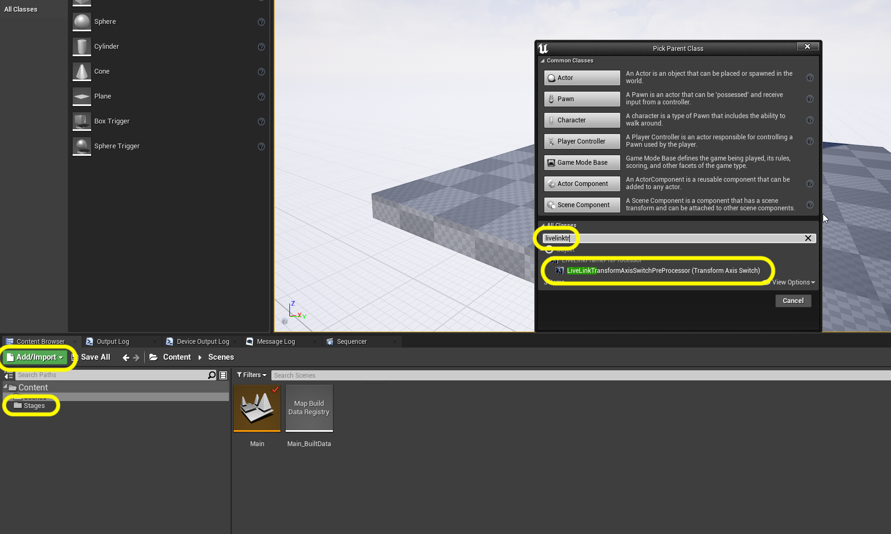
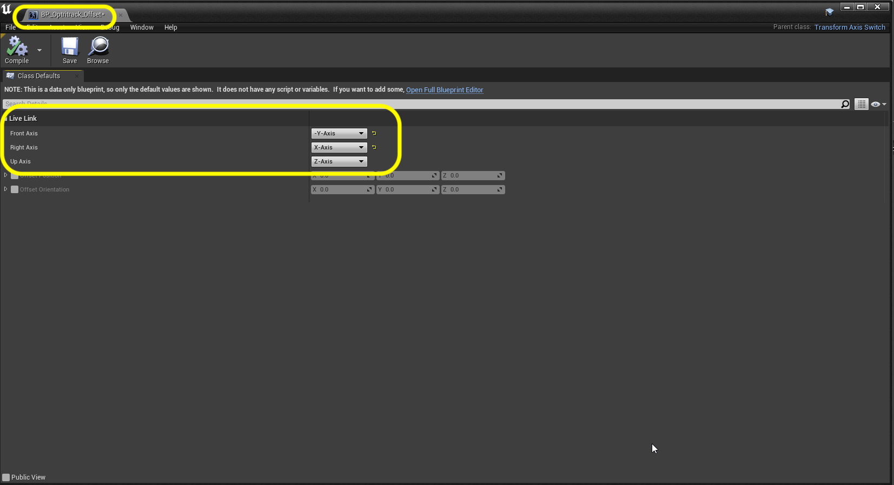
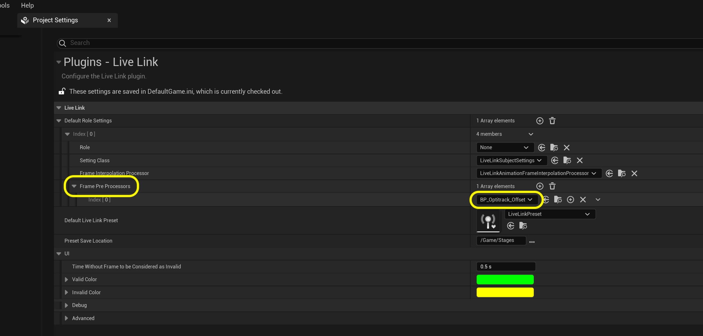
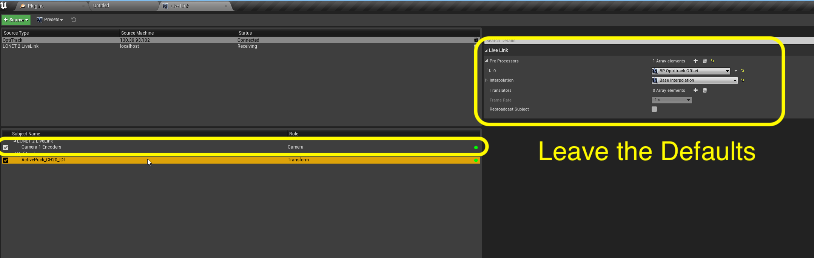
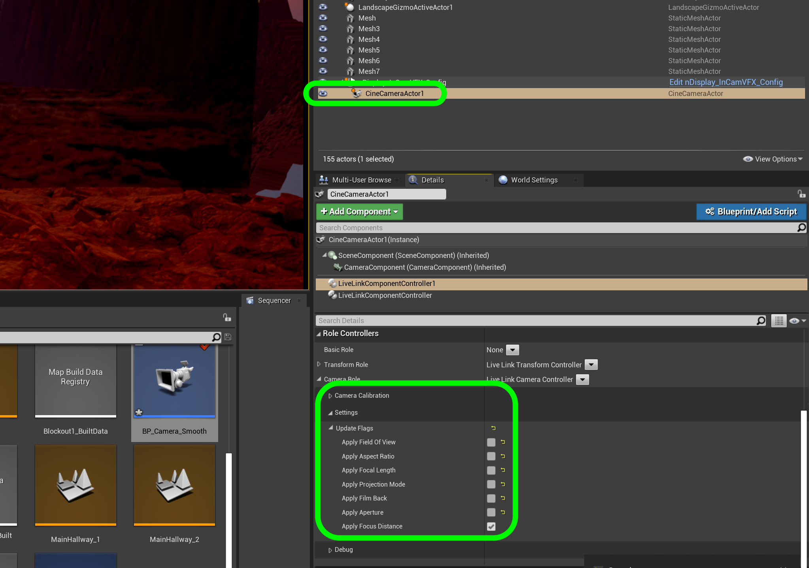

### Live Link

[previous](../ndisplay5-config/README.md#user-content-ndisplay-config) • [home](../README.md#user-content-gms2-background-tiles--sprites---table-of-contents) • [next](../hdr5-output/README.md#user-content-hdr-output)

Now we have the base nDisplay config set up.  We need to add camera tracking into our **Template**.  We have an **OptiTrack** motion capture system that will track the cameras. We also are using a **Lonet Server** for focus tracking. We do this in **Unreal** using the **Live Link** plugin.  Lets get started.

 

---

##### `Step 1.`\|`BTS`|:small_blue_diamond:

Lets get livelink setup to bring in Mocap data from the **OptiTrack**.  Make sure the motion capture system is turned on, has streaming enabled and has a static mesh tracking the camera on set.  Go to **Window | Virtual Production | Live Link**.

Press **+ Add** and select **OptiTrack Soucce** with default settings. Press the <kbd>Create</kbd> button.

 

##### `Step 2.`\|`BTS`|:small_blue_diamond: :small_blue_diamond: 

Make sure your tracker has a green (not yellow or red) light and the name of the static mesh is the same as the one on the tracker. In our case it is called **RED_Camera**. This is the rigid body that is set up in **Motive**. Make sure that **Rebroadcast Subject** is set to `true`.

##### `Step 3.`\|`BTS`|:small_blue_diamond: :small_blue_diamond: :small_blue_diamond:

Now the orientation of the axis in OptiTrack is not the same as what **Unreal** expects.  The camera would not mimic the movement on set correctly.  We need to select the **Stage** folder and press the <kbd>+ Add</kbd> button and select **Blueprint**.  Open up **All Classes** and this time we will search for the `LiveLinkTransformAxisSwitchPreProcessor(TransformAxisSwitch)`.

##### `Step 4.`\|`BTS`|:small_blue_diamond: :small_blue_diamond: :small_blue_diamond: :small_blue_diamond:

Call this new blueprint `BP_OptiTrack_Offset`.  Double click it.  It will either look like a normal blueprint or come in a reduced form.  In either case you want to set the **Front Axis** (what Unreal thinks of facing forward or **X**) as `-Y-axis` coming from **OptiTrack** (inverting the Y axis as the positive direction is wrong).  Set the **Right Axis** to the `X-Axis`.

##### `Step 5.`\|`BTS`| :small_orange_diamond:

Now we can open up the **LiveLink** window again and select the **RED_CAMERA** tracker in the **Subject Name** window.  Now in the **Pre Processor** press the **+** key and assign the **BP_Optitrack_Offset** blueprint that you just created in preprocessor slot `0`.

##### `Step 6.`\|`BTS`| :small_orange_diamond: :small_blue_diamond:

Now select **Presets** and choose `Save Preset`.  Save it to the **Stage** folder and call it `LiveLinkPreset`. Press the <kbd>Save</kbd> button.

##### `Step 7.`\|`BTS`| :small_orange_diamond: :small_blue_diamond: :small_blue_diamond:

Now this just adds it to this tracking machine.  We also need to add it to the project configuraiton so that all the other machines can get this offset as well.  Open up the **Edit | Project Settings** folder and select **Live Link** plugin settings.  Assign `LiveLinkPreset` to **Default Live Link Preset**. 

##### `Step 8.`\|`BTS`| :small_orange_diamond: :small_blue_diamond: :small_blue_diamond: :small_blue_diamond:

Now we also need to alter the orientation and add the pre processor. Press the **+** button next to the **Frame Pre Processors**. Assign **BP_OptiTrack_Offset** to this pre processor.

##### `Step 9.`\|`BTS`| :small_orange_diamond: :small_blue_diamond: :small_blue_diamond: :small_blue_diamond: :small_blue_diamond:

Now that we have the **LiveLink** setup we just need to have it communicate to our in game camera.  Go back  to the **Main** level and select the **RedKomodo** cinecamera.  Press the green <kbd>+</kbd> button and select a **Live Link Controller** component. Call this component `CameraLocationLiveLink`.

##### `Step 10.`\|`BTS`| :large_blue_diamond:

Now select the **Subject Representation** in the **Live Link Controller** and pick `RED_Camera`.

##### `Step 11.`\|`BTS`| :large_blue_diamond: :small_blue_diamond: 

Now you should see in game that the camera pops up to the position of where it is tracking in **OptiTrack Motive**.

##### `Step 12.`\|`BTS`| :large_blue_diamond: :small_blue_diamond: :small_blue_diamond: 

Now we need to add focus tracking.  Go back to the **Red Komodo** camera in the editor and go to the **Live Link** tab. Select **+ Source** and select the **LONET 2 Live Link** live link input and press the <kbd>OK</kbd> key.

##### `Step 13.`\|`BTS`| :large_blue_diamond: :small_blue_diamond: :small_blue_diamond:  :small_blue_diamond: 

Make sure the camera name you have in **LoNet** shows up under **Subject Name**.  Make sure the light is green.  Keep all the default settings.

##### `Step 14.`\|`BTS`| :large_blue_diamond: :small_blue_diamond: :small_blue_diamond: :small_blue_diamond:  :small_blue_diamond: 

Now that we have the **LiveLink** setup we just need to have it communicate to our in game camera.  Go back  to the **Main** level and select the **RedKomodo** cinecamera.  Press the green <kbd>+ Add Component</kbd> button and select a **Live Link Controller** component. Call this component `Live Link Lonet`.

##### `Step 15.`\|`BTS`| :large_blue_diamond: :small_orange_diamond: 

##### `Step 16.`\|`BTS`| :large_blue_diamond: :small_orange_diamond:   :small_blue_diamond: 

##### `Step 17.`\|`BTS`| :large_blue_diamond: :small_orange_diamond: :small_blue_diamond: :small_blue_diamond:

##### `Step 18.`\|`BTS`| :large_blue_diamond: :small_orange_diamond: :small_blue_diamond: :small_blue_diamond: :small_blue_diamond:

Now we have to select what the **LiveLink** data will be altering.  In this case it is pulling the **Focal Distance**. Turn off all of the settings we will not be using.

##### `Step 19.`\|`BTS`| :large_blue_diamond: :small_orange_diamond: :small_blue_diamond: :small_blue_diamond: :small_blue_diamond: :small_blue_diamond:

Now we are able to see the **Current Focus Distance** change when the focal ring is moved on the camera.

https://user-images.githubusercontent.com/5504953/157722365-b18b5091-1fbe-466f-9c8c-6ea4a2c872d5.mp4

##### `Step 20.`\|`BTS`| :large_blue_diamond: :large_blue_diamond:

If everything works resave the **Live Link** preset to the same file overwriting the old one.  Now we have live camera and lense tracking.

___

| [previous](../ndisplay5-config/README.md#user-content-ndisplay-config)| [home](../README.md#user-content-gms2-background-tiles--sprites---table-of-contents) | [next](../hdr5-output/README.md#user-content-hdr-output)|
|---|---|---|
