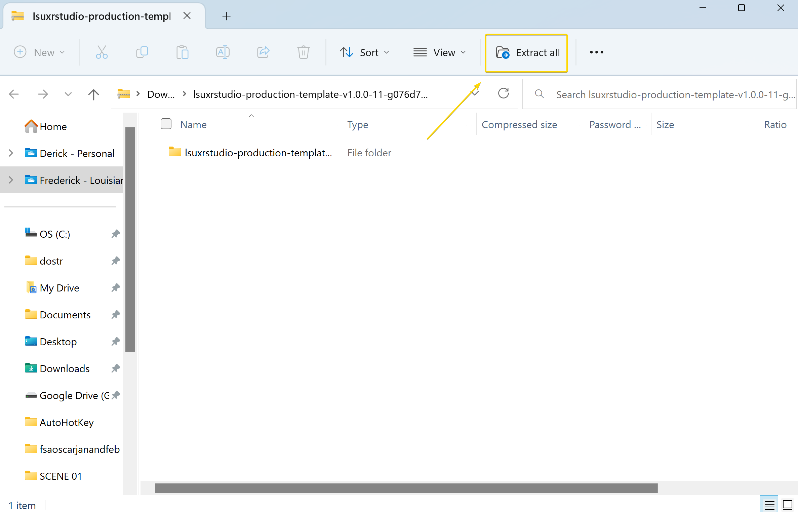

# Production Workflow

This guide goes over a production organization and workflow for ingesting media from the camera, editing, and exporting.

## Requirements
* Cloud Storage (Like Box or Google Drive)
* Hedge
* DaVinci Resolve
* Blackmagic Proxy Generator 

## Folder Structure

1. Download the folder structure from [here](https://github.com/lsuxrstudio/production-template/zipball/main).
2. Unzip this folder 

## Ingesting Footage

## Making Proxies

## Color Management

## Basic Editing

## Intermediate Editing

## Basic Color Grading

## Intermediate Color Grading

## Exporting