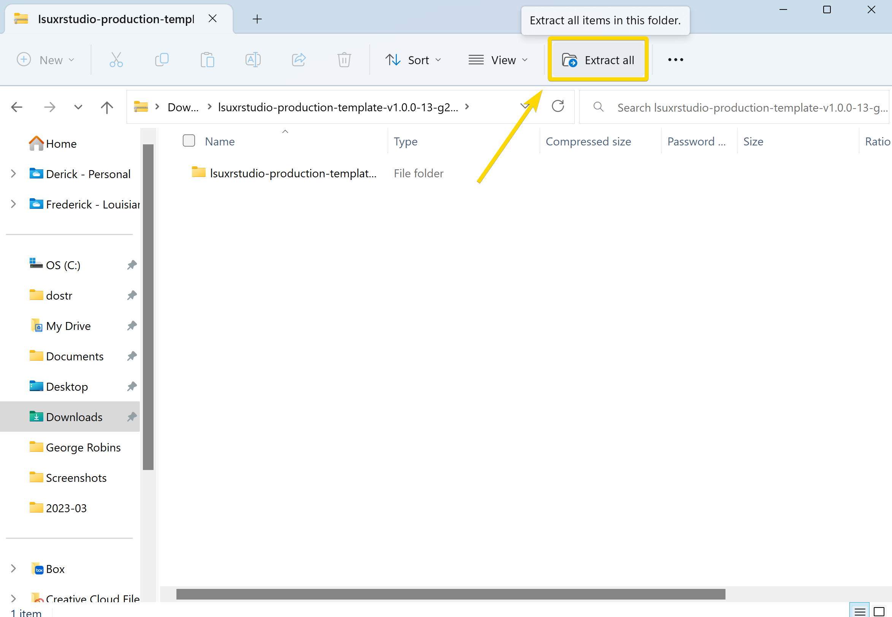
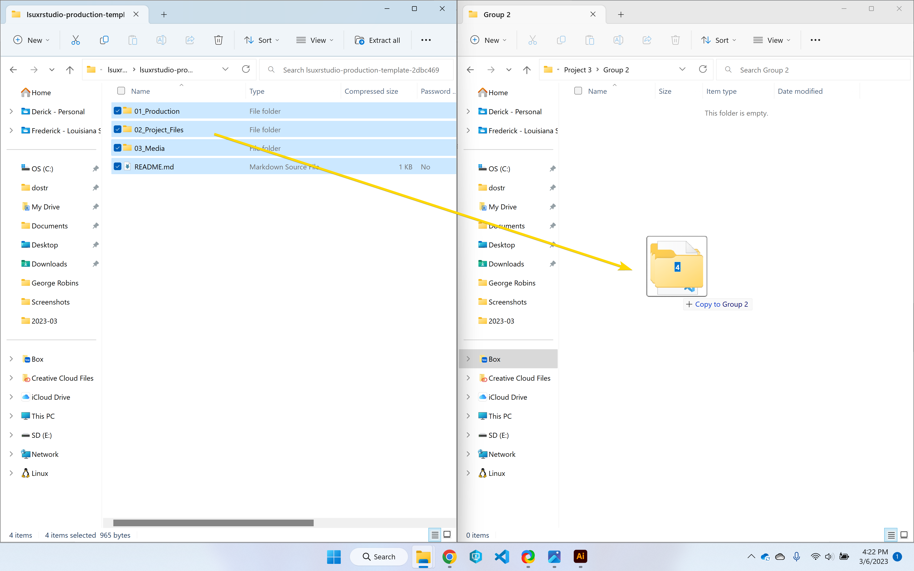

# Production Workflow

This guide goes over a production organization and workflow for ingesting media from the camera, editing, and exporting.

## Requirements
* Cloud Storage (Like Box or Google Drive)
* Hedge
* DaVinci Resolve
* Blackmagic Proxy Generator 

## Folder Structure

1. Download the folder structure from [https://github.com/lsuxrstudio/production-template](https://github.com/lsuxrstudio/production-template). Or use the direct download link [here](https://github.com/lsuxrstudio/production-template/zipball/main).

2. Unzip this folder 

3. Move the contents of this folder to Box

4. To read more about the way this folder structure works read the contents of the README's from here: [https://github.com/lsuxrstudio/production-template](https://github.com/lsuxrstudio/production-template). 

## Ingesting Footage

## Making Proxies

## Color Management

## Basic Editing

## Intermediate Editing

## Basic Color Grading

## Intermediate Color Grading

## Exporting