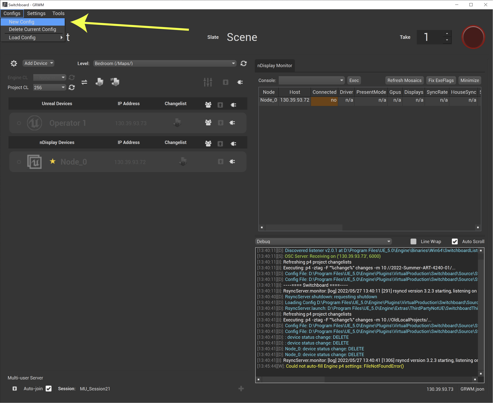
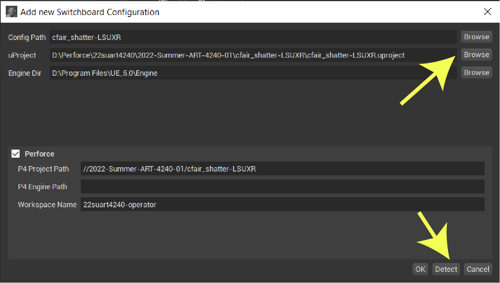
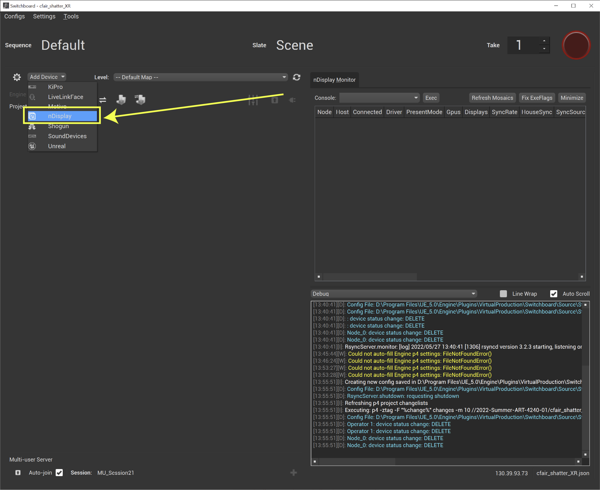
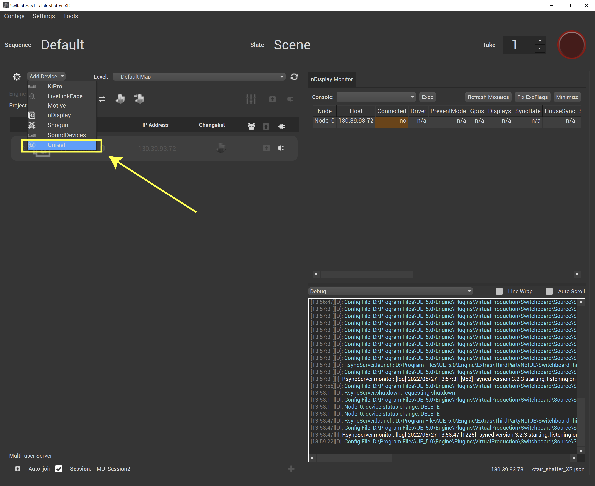
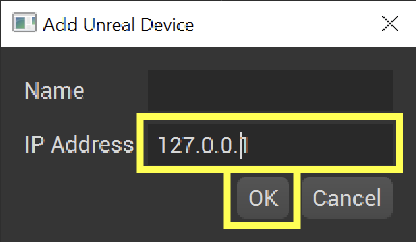
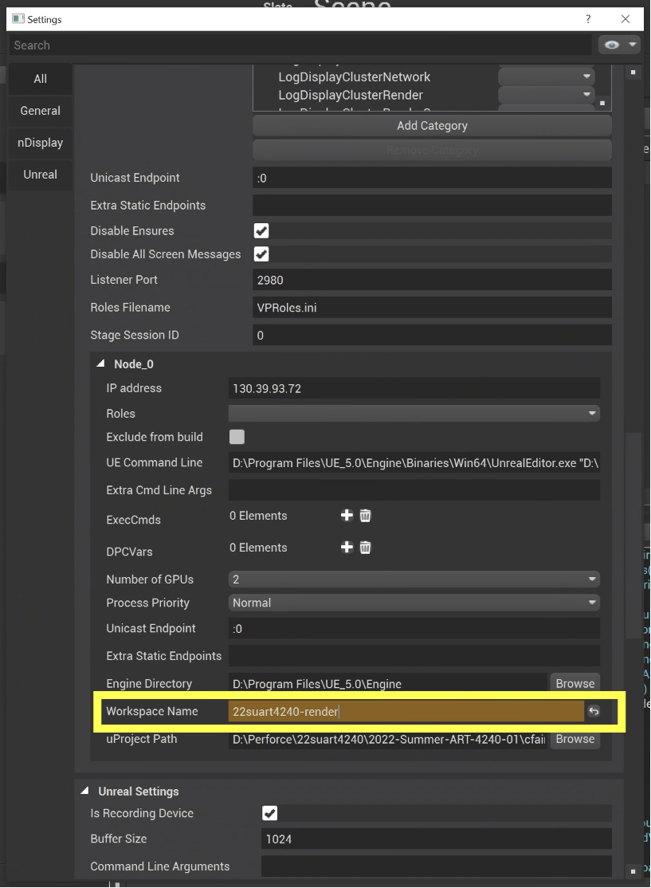
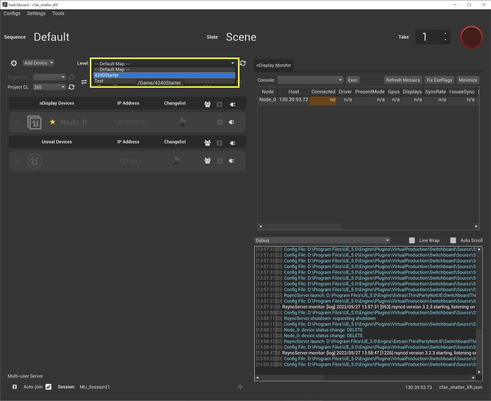
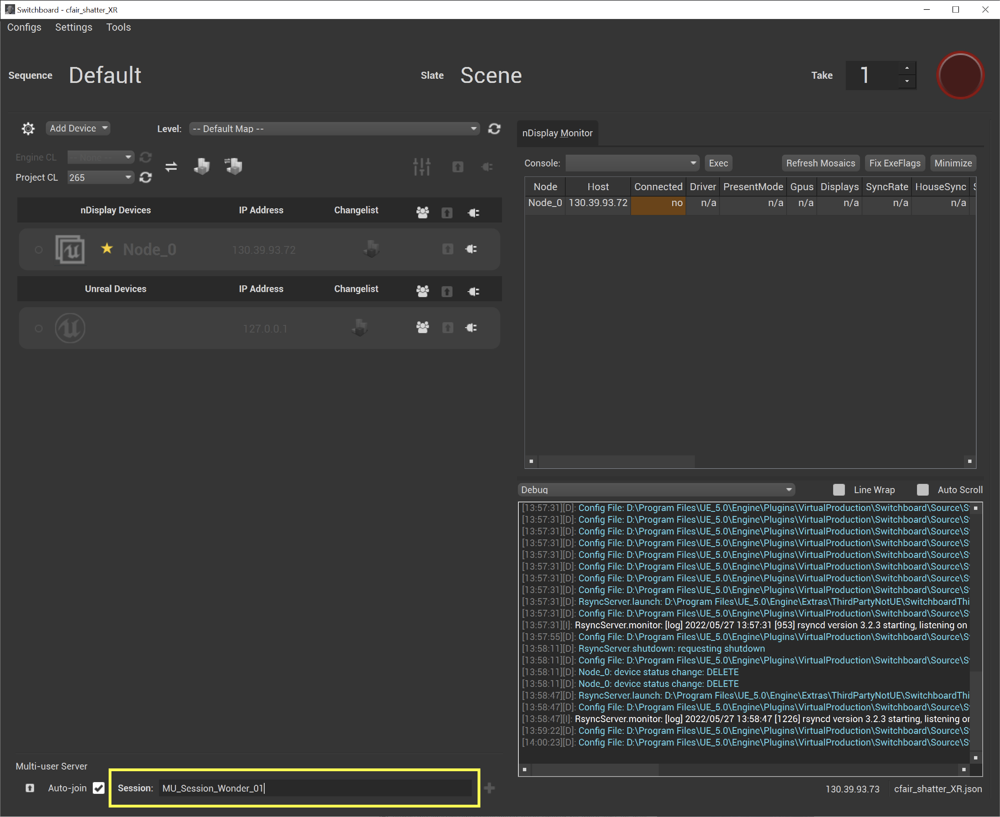

### Switchboard New Config

<sub>[previous](/README.md) • [home](/README.md) • [next](/README.md)</sub>


The following goes over how to create a new switchboard configuration.

<br>

### Guide To Do's 
- [ ] replace screenshot showing 127.0.0.1 with actual IP
- [ ] change C: to D: for engine path on node

---

#### Pre-reqs

1. Before proceeding make sure you’ve setup your Perfoce workspaces. See [Setting up Perforce on Operator and Render Nodes](../operator-and-render/README.md) 
2. Make sure you've setup your scene for nDisplay and camera tracking. It's easiest to start off with the LSUBaseTemplate and build your environment on top of that, but you may also build these components from scratch, or migrate your project into the LSUBaseTemplate, see: [LSU Base Template Migration](../template-migration/README.md).
3. It’s useful to connect the project to source control from within the editor first. This way switchboard can auto-populate some of the fields below.  
4. Make sure to close Unreal if you're going to launch Switchboard from outside the editor. 

#### Switchboard

1. If it's not already running, open **Switchboard Listener** using the desktop shortcut. It's also located at D:\Program Files\UE_5.0\Engine\Binaries\Win64\SwitchboardListener.exe.
2. Open **Switchboard** using the desktop shortcut It's also located at D:\Program Files\UE_5.0\Engine\Plugins\VirtualProduction\Switchboard\Source\Switchboard\switchboard.bat.
3. Go to Configs > **New Config**
    
    
    
4. Click **Browse** next to **uProject** and choose the project you want to use.
5. Click **Detect** and as long as your Unreal File has been already connected to Perforce it should bring in your P4 Project Path and Workspace Name. 

    
        
6. If it didn’t, you can check what they are by opening Perforce and copy pasting them in.

6. You can find the P4 Project Path by opening P4V and going to View > Workspaces and then double clicking your workspace. Thhe **Workspace** name is labled "Workspace" the **P4 Project Path** is the first part of your "View" mapping, ie //2023-Spring-ART-4240-02-VP.


8. Click Add Device > **nDisplay**

    
        
8. When asked for an nDisplay config file click **populate** and it should grab the one from inside your project. ie: D:\Users\virtualproduction\Perforce\art4240_DESN-ART302-01_3815\2022-Summer-ART-4240-01\cfair_shatter_XR\cfair_shatter_XR.uproject. 
9. Click Add Device > **Unreal** 
    
    
    
10. Use **130.39.93.73** for the IP address 

    
        
11. Go to Settings and change the **nDisplay Node_0 Workspace Name** to the workspace on that computer (i.e. 22suart4240-render).

    

11. Also under Setting, change the **uProject Path** to the path on the render computer.
        
12. Choose your **Level**. For the first time you might have to press the **Refresh** button to see the levels.
    
    
    
13. Name Your Multi-User Session something like **MU_Session_ProjectName_01** and press Enter.
    
    
    
14. Click 1) Refresh Change Lists; 2) Connect to Listener on nDisplay; 3) Connect to Listener on Unreal Device; 4) Sync all device; 5) Build all devices. 6) Connect All Devices; 7) Start All devices.

15. After about a minute the Unreal editor should open up on the operator and an Unreal build should  open on the render node(s).

#### Troubleshooting

- If switchboard throws an error that says “Could not start program p4” this can be for a couple reasons. One fix is to double check your uProject paths and workspace names are correct in the Switchboard settings. These should be different for the operator and render nodes. Another fix could be to log out and then back in to P4V. 

- One particlarly annoying issue that crops up is that the render node won't join the multi-user session. If this happens, click the stop and the disconnect icons next to *just* the render node in Switchboard. Then on the render node close and re-open the switchboard listener. Click connect and join for the render node back in Switchboard.

- If you get an error in the Unreal editor that you can't join your session or the "Joining Unreal Session" popup doesn't go away there may be multiuser sessions already running that conflict and that you can’t delete. One way to do fix this is to run the following and then press CTRL-C to exit.
    
    ```bash
    cd "D:\Program Files\UE_5.0\Engine\Binaries\Win64\”
    .\UnrealMultiUserServer.exe -ConcertClean
    ```
    
- If you get an error in Switchboard asking if we're connected to Source Control. Run the command `p4 login` from the command prompt. 

- Sometimes we have Unreal "ghost sessions" you can use Windows Tasks Manager to look for any instances of Unreal running in the background and close them down. 

- If you get the error message `Operator already running cstat_project a9508bb6-992c-4268-9989-27c16639908b` make sure to close out the multi user server window.

- If you get the error message `Node_0: Could not retrieve changelists for project. Are the Source Control Settings correctly configured?` This could happen because your worksapce names or file paths are incorrect in switchboard, double check these. Also, you can try opening a command prompt and type `p4 login` followed by you username and password.

- If for some reason the nDisplay node doesn't join the Multi User session and changes don't propogate in real-time between machines auto-join may have been disabled switchboard json config file. Unless you specified a custom location these are in `D:\Program Files\UE_5.0\Engine\Plugins\VirtualProduction\Switchboard\Source\Switchboard\configs`. Around line #125 change `"autojoin_mu_server": false` to `"autojoin_mu_server": true`. Alternatively, you can try loading and running a different Switchboard config that works and then go back to your original config and try it again. This also appears to help.

- Sometimes we might get a switchboard error saying `Node_0: nDisplay uasset transfer failed: Error while trying to write to D:\Perforce\22suart4240\2022-Summer-ART-4240-01\UnkownWanderer\Content\Stages\LSUnDisplayConfig.uasset`. I suspect this has to do with Perforce so you can double check what's checked out there, or simply logging off and on both nodes also seems to address this.

- If unreal crashes on render node try running the unreal project project on the the node and not through switchboard.

- When you've acceidently removed files after adding them and before sumitting themn. Revert. Sometimes you can't in the GUI. Send files to a  numbered changelist using P4V. Rt. Click **default** change list and select **New Pending Changelist**. Then open up terminal and use `p4 revert -c 10 //...`. Replace the **10** with the changelist number shown in P4V. See: https://portal.perforce.com/s/article/3453.

#### Resources

[In-Camera VFX Quick Start](https://docs.unrealengine.com/5.0/en-US/in-camera-vfx-quick-start-for-unreal-engine/)

[In-Camera VFX Production Test](https://docs.unrealengine.com/5.0/en-US/in-camera-vfx-production-test-sample-project-for-unreal-engine/)

---

| [previous](/README.md)| [home](/README.md) | [next](/README.md)|
|---|---|---|
