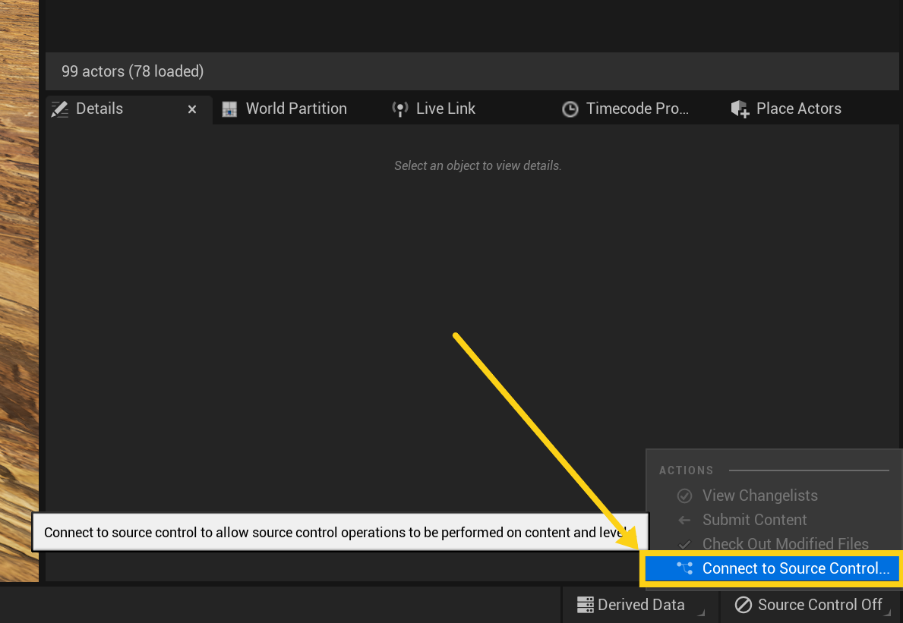
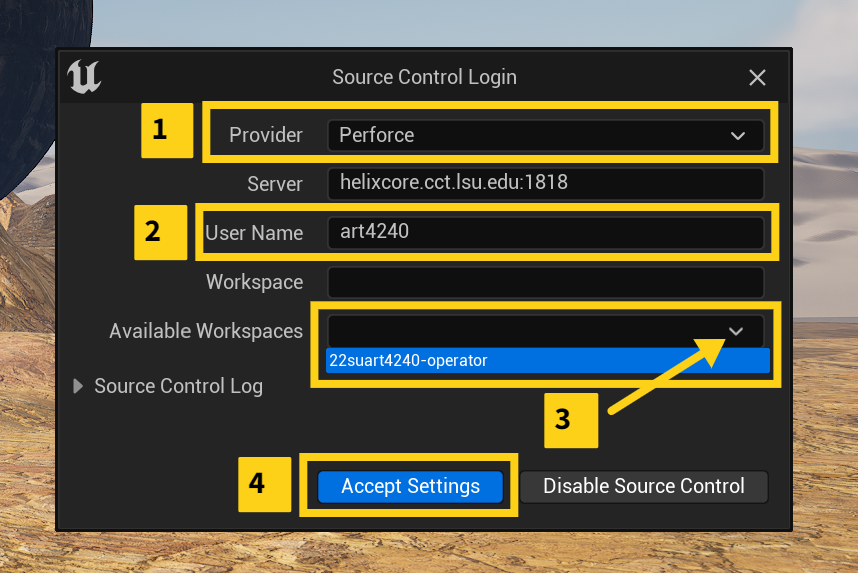
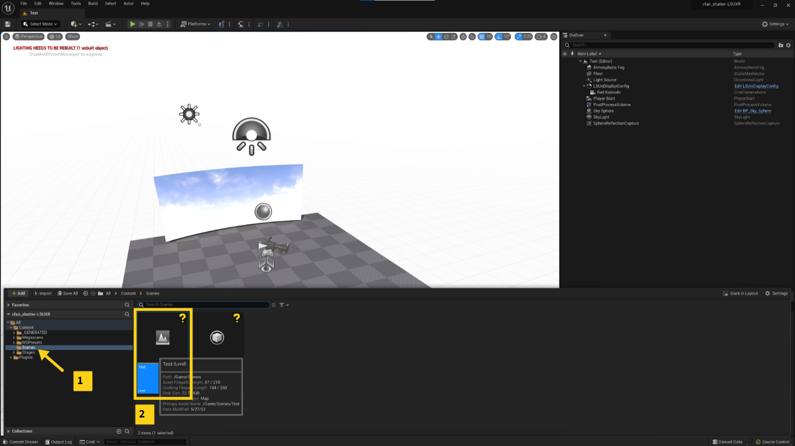

# LSU Base Template Migration

[previous](/README.md) • [home](/README.md) • [next](/README.md)

The following goes over how to migrate your project into the LSUBaseTemplate that has a basic configuration setup for you. In a lot of cases, if you’re making something for the wall you should just start with the LSUBaseTemplate. This is a guide in case we didn’t do that.

 

---

## Pre-reqs

1. Make sure you have gone through setting up Perforce on your laptop or artist workstation. See: [https://github.com/maubanel/p4v-unreal/blob/main/workspaces/README.md#user-content-workspaces-in-p4v](https://github.com/maubanel/p4v-unreal/blob/main/workspaces/README.md#user-content-workspaces-in-p4v). 
2. You should have the Templates directory already in your Perforce workspace.

## Template Migration

1. Copy and Paste the LSUBaseTemplate from the “Template” Depot folder into the class/group Depot folder.  

    

    
    
2. Rename the template folder and Unreal project to your project name followed by “LSUXR” at the end to remind you that this is your level brought into the template. For instance, cfair_shatter-LSUXR. However, be mindful to keep the name under 20 characters for Unreal.
3. If you have special plugins enabled in your orignal project such as Landmass or Water, open the new project and enable them.
4. Open your original project (ie, cfair_shatter)
5. Rt. Click the Level you want to export Asset Actions > Migrate 
    
    

6. Choose the template directory you had renamed earlier (cfair_shatter-LSUXR) 

    
    
7. Close your project.
8. Open your renamed template directory (cfair_shatter-LSUXR)
9. Click in the bottom right where it says Source Control Off and choose Connect to Source Control 
    
    
    
10. In the source control login window choose Perfoce, put your class/group login info in, and then under available workspaces select the one for the class/group. 
    
    
    
11. Open the level Test in Scenes Folder 
    
    
    
12. Select both LSUnDisplayConfig and Red Komodo in the outliner. Then rt. click copy. 
    
    

13. Go back to your level and rt. click paste in the outliner
14. Next click on the LSUnDisplayConfig item in the outliner and then in the Details pane select the ICVXFCamera. Under In-Camera VFX > CineCamera Actor choose the Red Komodo. 
    
    
    
15. You can position the nDisplayConfig item in a good spot so it sees what you want in the scene.
16. Save.
17. Click on source control and submit. 
18. Your level has now been migrated over. Continue on to template usage for basic operation.

---

| [previous](/README.md)| [home](/README.md) | [next](/README.md)|
|---|---|---|
