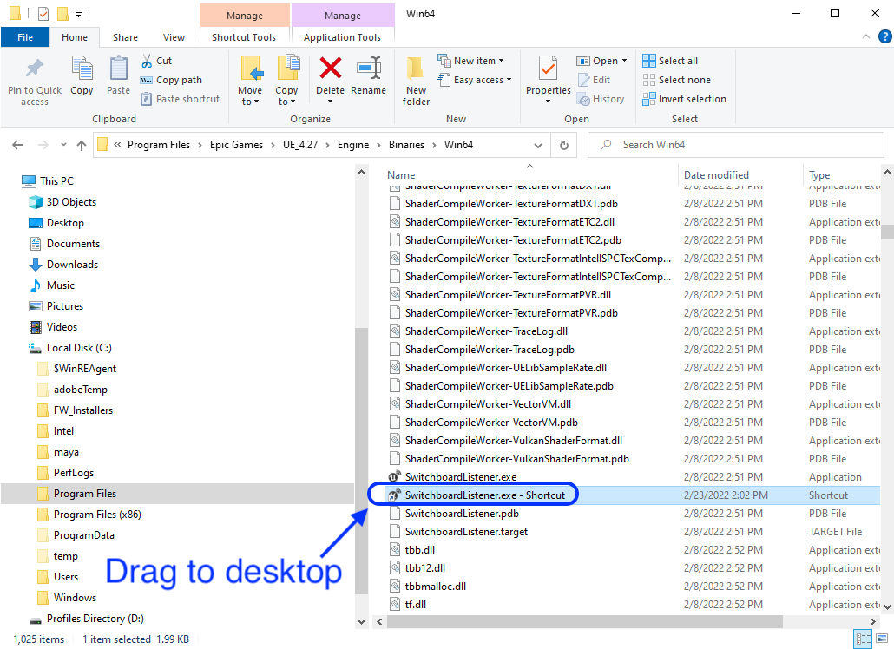

### Add Title

[previous](../) • [home](../README.md#user-content-gms2-background-tiles--sprites---table-of-contents) • [next](../)

How to create an Unreal project from scratch in Unreal 4.27 for an in camera virual production using LSU's equipment. UE5 is still in Beta and has not ported over the virutal production capablities from UE4 yet.

 

---

##### `Step 1.`\|`BTS`|:small_blue_diamond:

Run the **Epic Games Launcher** and run the latest version of Unreal. Selet the **Film, Television, and Live Events** project category.  Press the <kbd>Next</kbd> button. Select a **Blank** template. Press the <kbd>Next</kbd> button.

##### `Step 2.`\|`BTS`|:small_blue_diamond: :small_blue_diamond: 

Select whether you want starter content or not and whether you want to enable or disable Raytracing.  Please remember that you need an RTX or similar GPU that supports RayTracing. Name your project and select the <kbd>Create Project</kbd> button.

##### `Step 3.`\|`BTS`|:small_blue_diamond: :small_blue_diamond: :small_blue_diamond:

Open up **Edit | Plugins** and in the **Virtual Reality** section turn off **SteamVR**, **Oculus** and the three **OpenXR** plugins. You will need to restart the engine for this to take place.

##### `Step 4.`\|`BTS`|:small_blue_diamond: :small_blue_diamond: :small_blue_diamond: :small_blue_diamond:

Make sure **SwitchBoardListener is running**.  You can find it in **C:\Program Files\Epic Games\UE4_27\Engine\Binaries\Win64\SwitchboardListener.exe**.  Creata a shortcut for the desktop.  Run it.

##### `Step 5.`\|`BTS`| :small_orange_diamond:

Now you know if it working by making sure the terminal does not display any errors.  This looks good.

##### `Step 6.`\|`BTS`| :small_orange_diamond: :small_blue_diamond:

OK, we need to quit Unreal and set up a **Perforce Depot** (Project).  Either add to an existing Depot or create a new one in the **Admin** interface.  Use a normal **Local** depot. I called mine `Templates`. 

##### `Step 7.`\|`BTS`| :small_orange_diamond: :small_blue_diamond: :small_blue_diamond:

Now we need to add this new depot to the workspace (it does not know it is there). Right lick on the **Workspaces** in **P4V**.

##### `Step 8.`\|`BTS`| :small_orange_diamond: :small_blue_diamond: :small_blue_diamond: :small_blue_diamond:

Create a directory in your workspace drive (mine is D:\perforce) with the exact same name including caps as the depot.  So I have a new folder called `Templates`.  I added a `readme.txt` file with the name of the project in it. I then opened **P4V** and selected the **Pending** tab and right clicked and selected a **New Pending Changelist**.

Now drag **readme.txt** to the changelist and submit it to the server. 

##### `Step 9.`\|`BTS`| :small_orange_diamond: :small_blue_diamond: :small_blue_diamond: :small_blue_diamond: :small_blue_diamond:

 Now you should see the new Depot in the **Depot** tab.

##### `Step 10.`\|`BTS`| :large_blue_diamond:

##### `Step 11.`\|`BTS`| :large_blue_diamond: :small_blue_diamond: 

##### `Step 12.`\|`BTS`| :large_blue_diamond: :small_blue_diamond: :small_blue_diamond: 

##### `Step 13.`\|`BTS`| :large_blue_diamond: :small_blue_diamond: :small_blue_diamond:  :small_blue_diamond: 

##### `Step 14.`\|`BTS`| :large_blue_diamond: :small_blue_diamond: :small_blue_diamond: :small_blue_diamond:  :small_blue_diamond: 

##### `Step 15.`\|`BTS`| :large_blue_diamond: :small_orange_diamond: 

##### `Step 16.`\|`BTS`| :large_blue_diamond: :small_orange_diamond:   :small_blue_diamond: 

##### `Step 17.`\|`BTS`| :large_blue_diamond: :small_orange_diamond: :small_blue_diamond: :small_blue_diamond:

##### `Step 18.`\|`BTS`| :large_blue_diamond: :small_orange_diamond: :small_blue_diamond: :small_blue_diamond: :small_blue_diamond:

##### `Step 19.`\|`BTS`| :large_blue_diamond: :small_orange_diamond: :small_blue_diamond: :small_blue_diamond: :small_blue_diamond: :small_blue_diamond:

##### `Step 20.`\|`BTS`| :large_blue_diamond: :large_blue_diamond:

##### `Step 21.`\|`BTS`| :large_blue_diamond: :large_blue_diamond: :small_blue_diamond:

___

| [previous](../)| [home](../README.md#user-content-gms2-background-tiles--sprites---table-of-contents) | [next](../)|
|---|---|---|
