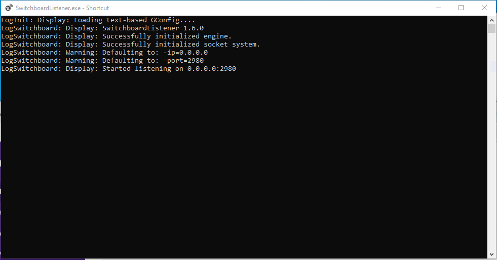

### Add Title

[previous](../) • [home](../README.md#user-content-gms2-background-tiles--sprites---table-of-contents) • [next](../)

How to create an Unreal project from scratch in Unreal 4.27 for an in camera virual production using LSU's equipment. UE5 is still in Beta and has not ported over the virutal production capablities from UE4 yet.

 

---

##### `Step 1.`\|`BTS`|:small_blue_diamond:

Run the **Epic Games Launcher** and run the latest version of Unreal. Selet the **Film, Television, and Live Events** project category.  Press the <kbd>Next</kbd> button. Select a **Blank** template. Press the <kbd>Next</kbd> button.

##### `Step 2.`\|`BTS`|:small_blue_diamond: :small_blue_diamond: 

Select whether you want starter content or not and whether you want to enable or disable Raytracing.  Please remember that you need an RTX or similar GPU that supports RayTracing. Name your project and select the <kbd>Create Project</kbd> button.

##### `Step 3.`\|`BTS`|:small_blue_diamond: :small_blue_diamond: :small_blue_diamond:

Open up **Edit | Plugins** and in the **Virtual Reality** section turn off **SteamVR**, **Oculus** and the three **OpenXR** plugins.

##### `Step 4.`\|`BTS`|:small_blue_diamond: :small_blue_diamond: :small_blue_diamond: :small_blue_diamond:

Make sure **SwitchBoardListener is running**.  You can find it in **C:\Program Files\Epic Games\UE4_27\Engine\Binaries\Win64\SwitchboardListener.exe**.  Creata a shortcut for the desktop.  Run it.

##### `Step 5.`\|`BTS`| :small_orange_diamond:

Now you know if it working by making sure the terminal does not display any errors.  This looks good.

##### `Step 6.`\|`BTS`| :small_orange_diamond: :small_blue_diamond:

##### `Step 7.`\|`BTS`| :small_orange_diamond: :small_blue_diamond: :small_blue_diamond:

##### `Step 8.`\|`BTS`| :small_orange_diamond: :small_blue_diamond: :small_blue_diamond: :small_blue_diamond:

##### `Step 9.`\|`BTS`| :small_orange_diamond: :small_blue_diamond: :small_blue_diamond: :small_blue_diamond: :small_blue_diamond:

##### `Step 10.`\|`BTS`| :large_blue_diamond:

##### `Step 11.`\|`BTS`| :large_blue_diamond: :small_blue_diamond: 

##### `Step 12.`\|`BTS`| :large_blue_diamond: :small_blue_diamond: :small_blue_diamond: 

##### `Step 13.`\|`BTS`| :large_blue_diamond: :small_blue_diamond: :small_blue_diamond:  :small_blue_diamond: 

##### `Step 14.`\|`BTS`| :large_blue_diamond: :small_blue_diamond: :small_blue_diamond: :small_blue_diamond:  :small_blue_diamond: 

##### `Step 15.`\|`BTS`| :large_blue_diamond: :small_orange_diamond: 

##### `Step 16.`\|`BTS`| :large_blue_diamond: :small_orange_diamond:   :small_blue_diamond: 

##### `Step 17.`\|`BTS`| :large_blue_diamond: :small_orange_diamond: :small_blue_diamond: :small_blue_diamond:

##### `Step 18.`\|`BTS`| :large_blue_diamond: :small_orange_diamond: :small_blue_diamond: :small_blue_diamond: :small_blue_diamond:

##### `Step 19.`\|`BTS`| :large_blue_diamond: :small_orange_diamond: :small_blue_diamond: :small_blue_diamond: :small_blue_diamond: :small_blue_diamond:

##### `Step 20.`\|`BTS`| :large_blue_diamond: :large_blue_diamond:

##### `Step 21.`\|`BTS`| :large_blue_diamond: :large_blue_diamond: :small_blue_diamond:

___

| [previous](../)| [home](../README.md#user-content-gms2-background-tiles--sprites---table-of-contents) | [next](../)|
|---|---|---|
