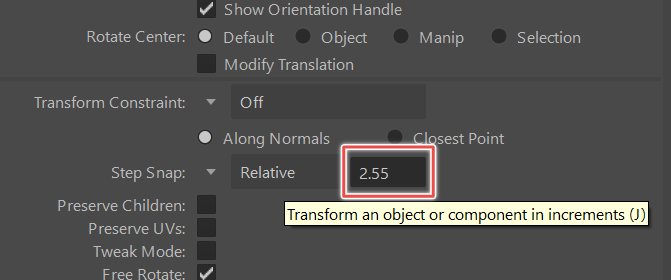
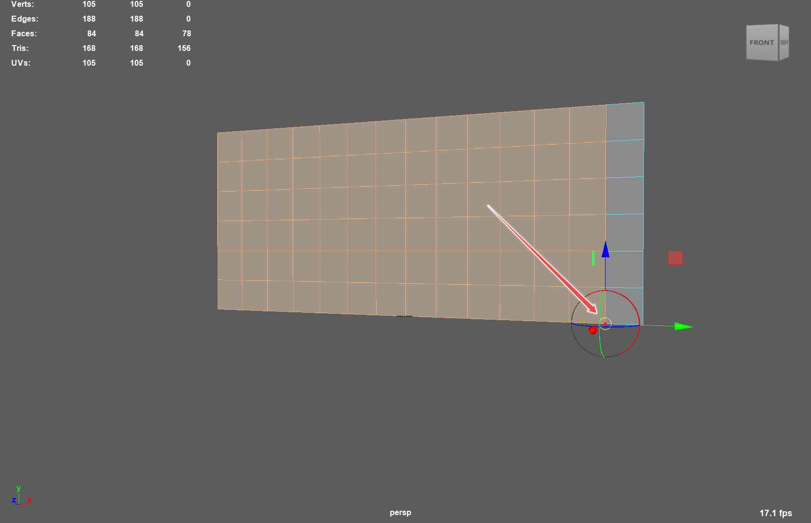
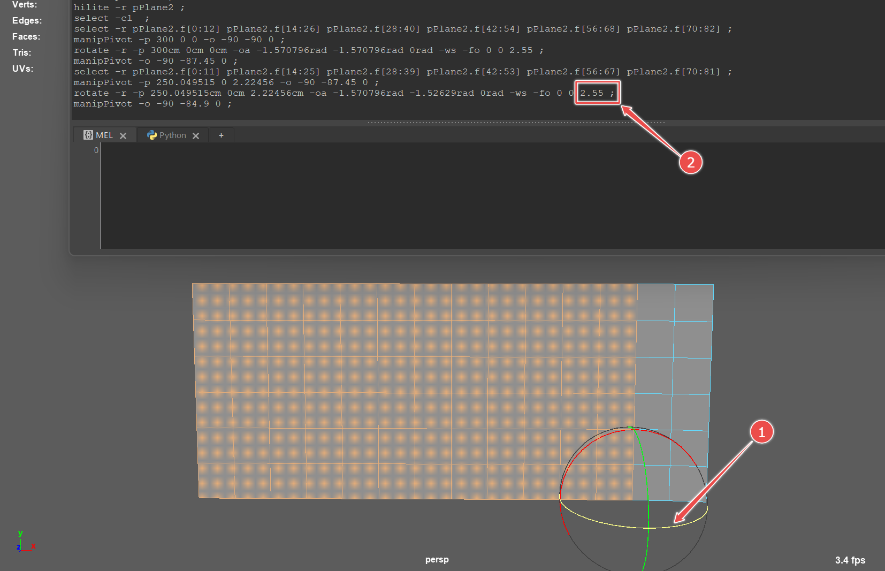

### Making a LED Wall Mesh in Maya

[previous](../) • [home](../README.md) • [next](../)

This goes over how to make a new LED Wall Mesh in Maya.

#### Resources

* https://docs.unrealengine.com/5.0/en-US/in-camera-vfx-quick-start-for-unreal-engine/

 

---

##### `Step 1.`\|`BTS`|:small_blue_diamond:

Create a plane in Maya by clicking the create plane button.

##### `Step 2.`\|`BTS`|:small_blue_diamond: :small_blue_diamond: 

In the channel box click INPUTS > polyPlane. Adjust the number of subdivisions so that it matches the number of subdivisions the wall has. For instance our wall is 14x6. So give it 14 subdivisions for the width and 6 subdivisions for the height. Also, adjust the width and height to match the wall. Fo instance our wall has 50cmx50cm LED tiles so  its width is 50cm x 14 = 700cm and its height is 50cm x 6 = 300cm.  

##### `Step 3.`\|`BTS`|:small_blue_diamond: :small_blue_diamond: :small_blue_diamond:

Rotate the wall so that it's facing Maya's Front axis. We'll likely need to rotate the wall again when it's brought into Unreal.

##### `Step 4.`\|`BTS`|:small_blue_diamond: :small_blue_diamond: :small_blue_diamond: :small_blue_diamond:

Double click the roate tool in Maya to open up its tool options. Change Step Snapping to Relative 2.55 degrees. This is the amount by which each of our panels are curved.

##### `Step 5.`\|`BTS`| :small_orange_diamond:

Select all faces except for the first column and then press the 'd' key to change pivot to the bottom of the second column of edges.

##### `Step 6.`\|`BTS`| :small_orange_diamond: :small_blue_diamond:

With the script editor open to double check your work rotate the faces 2.55 degrees. Keep doing this for each column until the curve is complete. We're purposefully starting with right side and moving to the left since our physical wall happens to have the first column of LED panels parallel to the room's origin.

##### `Step 7.`\|`BTS`| :small_orange_diamond: :small_blue_diamond: :small_blue_diamond:

Now you need to position the wall correctly in space. You *could* choose to keep the pivot centered and place the wall at the origin in Maya and then poistion the wall in the Unreal nDisplay config. However, since we know where our physical room origin should be, we are going to go ahead and position the wall in relation to this point. 

To do this, we are going to use the 'd' key to position the wall's pivot at the center bottom. Then, we are going to freeze transformations and move the wall back 15ft (457.2cm) from the origin.  

##### `Step 8.`\|`BTS`| :small_orange_diamond: :small_blue_diamond: :small_blue_diamond: :small_blue_diamond:

Unreal wants two sets of UV's. Select the wall. Open up the UV editor. Go to Creaete > Planar []. In the options Check Z-axis. Then Apply. You should get a set of UV's that fill the 0 to 1 UV space. 

##### `Step 9.`\|`BTS`| :small_orange_diamond: :small_blue_diamond: :small_blue_diamond: :small_blue_diamond: :small_blue_diamond:

We also need a second UV set with UV's that maintain the aspect ratio of the wall. To do this, go to Create > Planar [] again and then tick on "Keep image width/height ratio". Also, tick on create new UV set. Name this "map2".

##### `Step 10.`\|`BTS`| :large_blue_diamond:

Export FBX

##### `Step 11.`\|`BTS`| :large_blue_diamond: :small_blue_diamond: 

##### `Step 12.`\|`BTS`| :large_blue_diamond: :small_blue_diamond: :small_blue_diamond: 

##### `Step 13.`\|`BTS`| :large_blue_diamond: :small_blue_diamond: :small_blue_diamond:  :small_blue_diamond: 

##### `Step 14.`\|`BTS`| :large_blue_diamond: :small_blue_diamond: :small_blue_diamond: :small_blue_diamond:  :small_blue_diamond: 

##### `Step 15.`\|`BTS`| :large_blue_diamond: :small_orange_diamond: 

##### `Step 16.`\|`BTS`| :large_blue_diamond: :small_orange_diamond:   :small_blue_diamond: 

##### `Step 17.`\|`BTS`| :large_blue_diamond: :small_orange_diamond: :small_blue_diamond: :small_blue_diamond:

##### `Step 18.`\|`BTS`| :large_blue_diamond: :small_orange_diamond: :small_blue_diamond: :small_blue_diamond: :small_blue_diamond:

##### `Step 19.`\|`BTS`| :large_blue_diamond: :small_orange_diamond: :small_blue_diamond: :small_blue_diamond: :small_blue_diamond: :small_blue_diamond:

##### `Step 20.`\|`BTS`| :large_blue_diamond: :large_blue_diamond:

##### `Step 21.`\|`BTS`| :large_blue_diamond: :large_blue_diamond: :small_blue_diamond:

___

CREATE BANNER WITH https://via.placeholder.com/1000x100/45D7CA/000000/?text=Next Up - ADD NEXT PAGE

| [previous](../)| [home](../README.md) | [next](../)|
|---|---|---|
