### Making a LED Wall Mesh in Maya

[previous](../) • [home](../README.md) • [next](../unreal5-base-setup)

This goes over how to make a new LED Wall Mesh in Maya.

#### Resources

* https://docs.unrealengine.com/5.0/en-US/in-camera-vfx-quick-start-for-unreal-engine/

#### Video Tutorial

* https://www.loom.com/share/11324c00ebfd4ffe9fd30a1c3f12158b

 

---

##### `Step 1.`\|`BTS`|:small_blue_diamond:

Create a plane in Maya by clicking the create plane button.

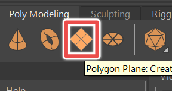

##### `Step 2.`\|`BTS`|:small_blue_diamond: :small_blue_diamond: 

In the channel box click INPUTS > polyPlane. Adjust the number of subdivisions so that it matches the number of subdivisions the wall has. For instance our wall is 14x6. So give it 14 subdivisions for the width and 6 subdivisions for the height. Also, adjust the width and height to match the wall. Fo instance our wall has 50cmx50cm LED tiles so  its width is 50cm x 14 = 700cm and its height is 50cm x 6 = 300cm.  

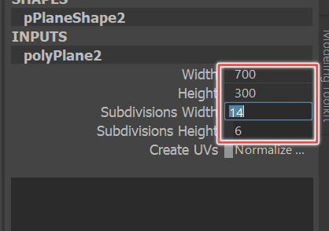

##### `Step 3.`\|`BTS`|:small_blue_diamond: :small_blue_diamond: :small_blue_diamond:

Rotate the wall so that it's facing Maya's Front axis: 90 degrees in the Rotate X channel. We'll likely need to rotate the wall again when it's brought into Unreal.

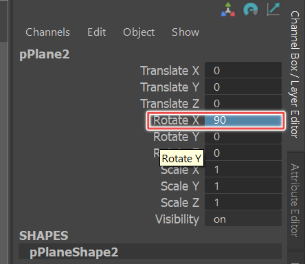

##### `Step 4.`\|`BTS`|:small_blue_diamond: :small_blue_diamond: :small_blue_diamond: :small_blue_diamond:

Go to object selection mode and select the wall. Press the 'd' and change the pivot of the wall to the second column of edges from the left by clicking on one of these edges. This allows us to use Maya's input line to make precise adjustments relative to the objects pivot.

##### `Step 5.`\|`BTS`| :small_orange_diamond:

Select the frist column of faces. Press the 'e' key to enter rotate mode. Then go to Maya's "input line" at the top right corner of the screen and type -2.55 for the Z value.

##### `Step 6.`\|`BTS`| :small_orange_diamond: :small_blue_diamond:

Go back to object selection mode, move the pivot to the 3rd column of edges. Then select the first and second column of faces. Go into rotation mode again and type -2.55 in the Z again. Keep doing this until you are at the center column of edges. This column is special. We're going to rotate it half of 2.55 degrees from the left and then hald of 2.55 degrees from the right. This keeps our wall centered around our origin.  

Now keep rotating our faces around the edges for the right side. You'll use positive 2.55 on the input line for this side. 

##### `Step 7.`\|`BTS`| :small_orange_diamond: :small_blue_diamond: :small_blue_diamond:

Now you need to position the wall correctly in space. You *could* choose to keep the pivot centered and place the wall at the origin in Maya and then poistion the wall in the Unreal nDisplay config. However, since we know where our physical room origin should be, we are going to go ahead and position the wall in relation to this point. 

To do this, we are going to use the 'd' key to position the wall's pivot at the center bottom. Then, we are going to freeze transformations and move the wall back 12ft (365.76cm) from the origin.  

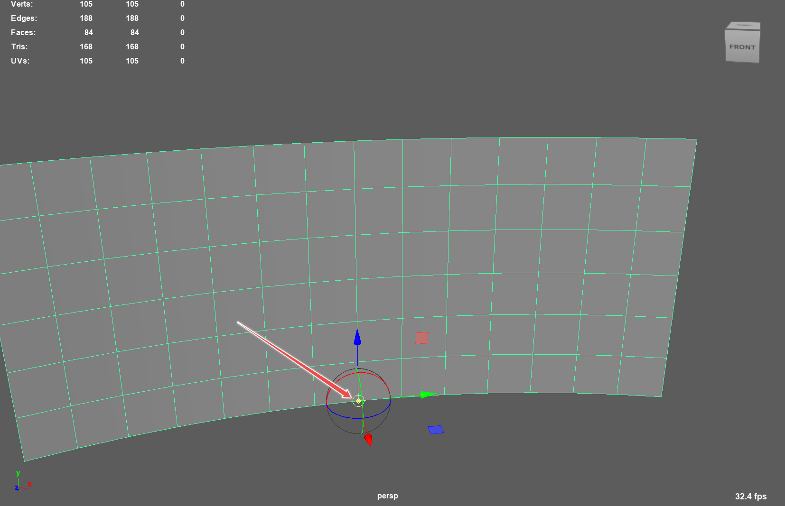
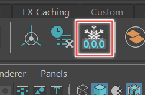
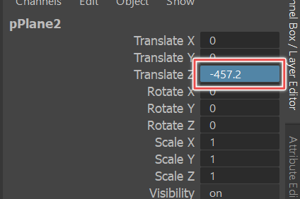

##### `Step 8.`\|`BTS`| :small_orange_diamond: :small_blue_diamond: :small_blue_diamond: :small_blue_diamond:

Unreal wants two sets of UV's. Select the wall. Open up the UV editor. Go to Creaete > Planar []. In the options Check Z-axis. Then Apply. You should get a set of UV's that fill the 0 to 1 UV space. 

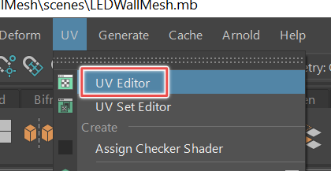
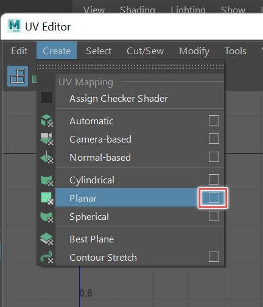
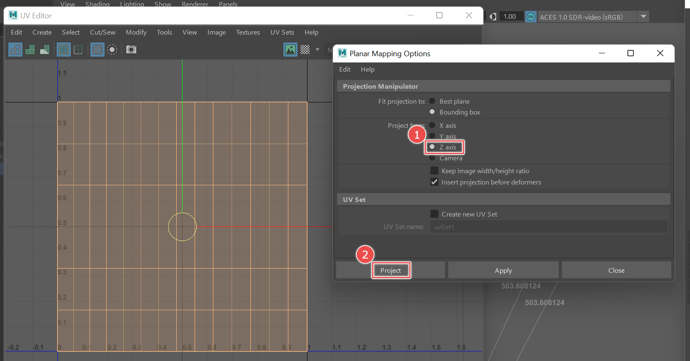

##### `Step 9.`\|`BTS`| :small_orange_diamond: :small_blue_diamond: :small_blue_diamond: :small_blue_diamond: :small_blue_diamond:

We also need a second UV set with UV's that maintain the aspect ratio of the wall. To do this, go to Create > Planar [] again and then tick on "Keep image width/height ratio". Also, tick on create new UV set. Name this "map2".

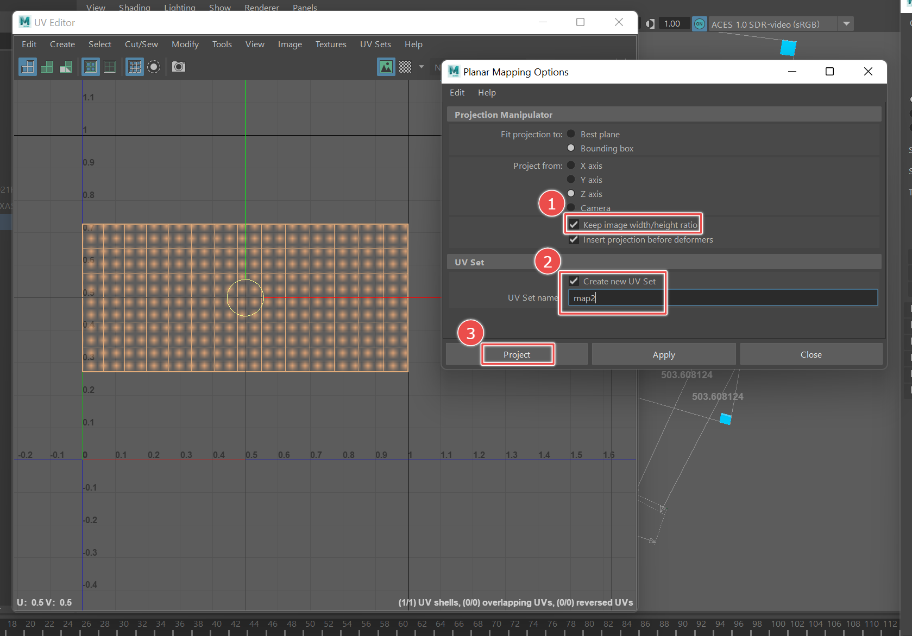

##### `Step 10.`\|`BTS`| :large_blue_diamond:

Select the mesh and then go to File > Export Selection. Choose FBX under Files of type. In the export options... 

- Untick everything under "Include these inputs" (History, Channels, etc). 
- Tick on "Smoothing Groups" under Geometry
- Untick Animation, Camera, Lights, Audio, Embed Media. 

Now you can import this FBX into Unreal. [Click here for the Maya file](files/LSULEDMeshV2.mb) and [click here for the FBX file](files/LSULEDMeshV2.fbx). 

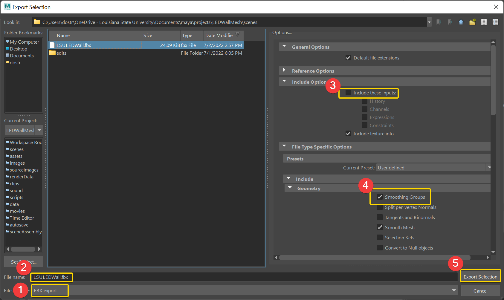

___

| [previous](../)| [home](../README.md) | [next](../unreal5-base-setup)|
|---|---|---|
